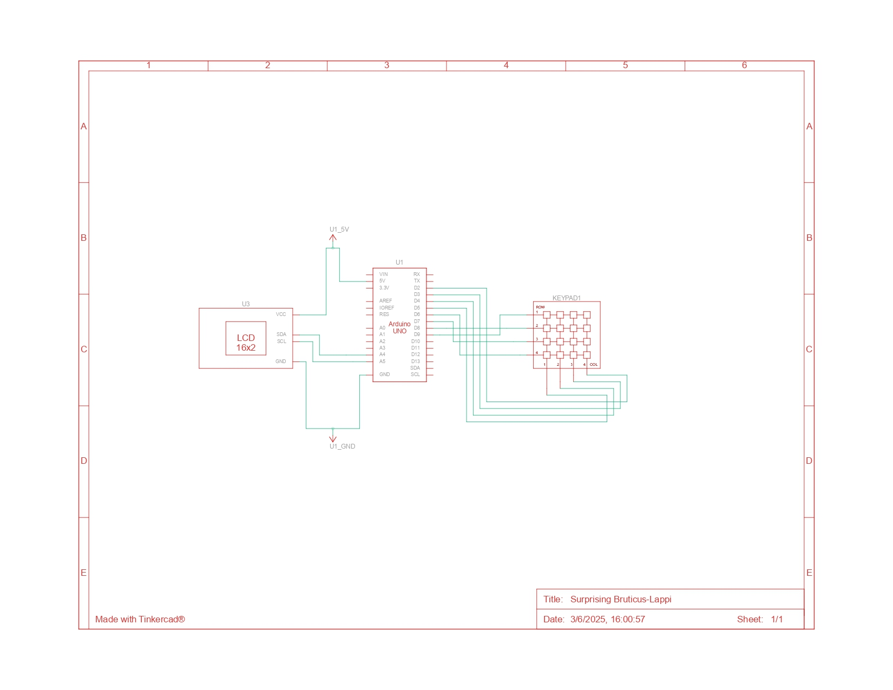

# Prototipo
Trabajo de Universidad.
> [!NOTE]
> _Este es un trabajo aun en proceso para la universidad, Clase Electronica_

**Materiales**
>-Pantalla LCD 16x2px.

>-Matriz 4x4 (16 Bótones).

>-Arduino Uno(USB).

>-Cables de coneccion.

### "nombre faltante"
_Con el paso de los dias estoy buscando ideas para usar de modo la pantalla y botones._
#### Ideas Precentes
De momento las ideas que tengo en mente son 2.
*Aclaro que sigue todo en proceso por lo que sigo pensando ideas respecto al uso de los materiales o si le sumo algo mas*
Partio principalmente como un juego clasico o antiguo llamado (El colgado)
Ahora estoy pensando en volerlo una cajita de frases.



## Códigos Usados
Codigo N°1
```
#include <Wire.h>
#include <LiquidCrystal_I2C.h>
#include <Keypad.h>

// LCD I2C
LiquidCrystal_I2C lcd(0x27, 16, 2);  // Asegúrate de que 0x27 sea tu dirección I2C

// Teclado 4x4
const byte ROWS = 4;
const byte COLS = 4;
char keys[ROWS][COLS] = {
  {'M','N','O','P'},
  {'I','J','K','L'},
  {'E','F','G','H'},
  {'A','B','C','D'}
};
byte rowPins[ROWS] = {2, 3, 4, 5};
byte colPins[COLS] = {6, 7, 8, 9};
Keypad keypad = Keypad(makeKeymap(keys), rowPins, colPins, ROWS, COLS);

// LEDs
const int lifeLEDs[3] = {10, 11, 12}; // LEDs rojos
const int winLED = 13;                // LED verde

// Palabras
String palabras[] = {"LEGGO", "CAPA", "LUNA", "SOL", "PERRO"};
int nivel = 0;
int vidas = 3;
String palabraActual;
String palabraVisible;
String letrasFaltantes;

void setup() {
  lcd.init();
  lcd.backlight();
  randomSeed(analogRead(A0)); // Semilla para aleatorio

  for (int i = 0; i < 3; i++) pinMode(lifeLEDs[i], OUTPUT);
  pinMode(winLED, OUTPUT);

  iniciarNivel();
}

void iniciarNivel() {
  vidas = 3;
  for (int i = 0; i < 3; i++) digitalWrite(lifeLEDs[i], HIGH);
  digitalWrite(winLED, LOW);

  palabraActual = palabras[nivel];
  palabraVisible = palabraActual;
  letrasFaltantes = "";

  // Ocultar el 20% de las letras (mínimo 1)
  int letrasAOcultar = max(1, palabraActual.length() / 2);
  while (letrasAOcultar > 0) {
    int i = random(palabraActual.length());
    if (palabraVisible[i] != '_') {
      palabraVisible[i] = '_';
      letrasFaltantes += palabraActual[i];
      letrasAOcultar--;
    }
  }

  mostrarPantalla();
}

void mostrarPantalla() {
  lcd.clear();
  lcd.setCursor(0, 0);
  lcd.print("Nombra el Juego");
  lcd.setCursor(0, 1);
  lcd.print(palabraVisible);
}

void loop() {
  char tecla = keypad.getKey();
  if (tecla) {
    tecla = toupper(tecla);

    if (letrasFaltantes.indexOf(tecla) != -1) {
      // Letra correcta
      for (int i = 0; i < palabraActual.length(); i++) {
        if (palabraActual[i] == tecla && palabraVisible[i] == '_') {
          palabraVisible[i] = tecla;
        }
      }
      letrasFaltantes.remove(letrasFaltantes.indexOf(tecla), 1);
    } else {
      // Letra incorrecta
      if (vidas > 0) {
        vidas--;
        digitalWrite(lifeLEDs[vidas], LOW);
      }
    }

    mostrarPantalla();
  }

  if (palabraVisible == palabraActual) {
    digitalWrite(winLED, HIGH);
    delay(2000);
    nivel = (nivel + 1) % (sizeof(palabras) / sizeof(palabras[0]));
    iniciarNivel();
  }

  if (vidas == 0) {
    lcd.clear();
    lcd.setCursor(0, 0);
    lcd.print("Perdiste!");
    lcd.setCursor(0, 1);
    lcd.print("Palabra: " + palabraActual);
    delay(3000);
    iniciarNivel();
  }
```
Codigo N°2
```
#include <Wire.h>
#include <LiquidCrystal_I2C.h>
#include <Keypad.h>

LiquidCrystal_I2C lcd(0x27, 16, 2); // Dirección del LCD y tamaño

// Teclado 4x4
const byte ROWS = 4;
const byte COLS = 4;
char keys[ROWS][COLS] = {
  {'D','F','G','H'},
  {'9','A','B','C'},
  {'5','6','7','8'},
  {'1','2','3','4'}
};
byte rowPins[ROWS] = {2, 3, 4, 5}; 
byte colPins[COLS] = {6, 7, 8, 9};

Keypad keypad = Keypad(makeKeymap(keys), rowPins, colPins, ROWS, COLS);

// Frases por botón — parte 1 y parte 2
String frasesParte1[16] = {
  "Eres una luz",         // '1'
  "Sigue tu camino",      // '2'
  "Nunca te rindas",      // '3'
  "Tu puedes lograrlo",   // '4'
  "Cree en tu fuerza",    // '5'
  "Ama sin medida",       // '6'
  "Eres valiente",        // '7'
  "Hazlo con amor",       // '8'
  "Brilla con fuerza",    // '9'
  "Respira profundo",     // 'A'
  "Hoy es tu dia",        // 'B'
  "Todo pasara",          // 'C'
  "Sigue adelante",       // 'D'
  "Confia en ti",         // 'E'
  "Sueña en grande",      // 'F'
  "La calma llega"        // 'G'
};

String frasesParte2[16] = {
  "en dias oscuros.",         // '1'
  "con paso firme.",          // '2'
  "sigue intentandolo.",      // '3'
  "todo es posible.",         // '4'
  "y en tu valor.",           // '5'
  "sin esperar nada.",        // '6'
  "aunque dudes.",            // '7'
  "sin miedo.",               // '8'
  "como el sol.",             // '9'
  "y sigue andando.",         // 'A'
  "hazlo tuyo.",              // 'B'
  "todo mejora.",             // 'C'
  "sin mirar atras.",         // 'D'
  "siempre lo haras.",        // 'F'
  "sin limites.",             // 'G'
  "si lo permites."           // 'H'
};

void setup() {
  lcd.init();
  lcd.backlight();
  lcd.setCursor(0, 0);
  lcd.print("Caja de frases");
  delay(2000);
  lcd.clear();
}

void loop() {
  char tecla = keypad.getKey();
  if (tecla) {
    int index = keyToIndex(tecla);
    if (index != -1) {
      mostrarFrase(frasesParte1[index], frasesParte2[index]);
    }
  }
}

int keyToIndex(char key) {
  switch (key) {
    case '1': return 0;
    case '2': return 1;
    case '3': return 2;
    case 'A': return 3;
    case '4': return 4;
    case '5': return 5;
    case '6': return 6;
    case 'B': return 7;
    case '7': return 8;
    case '8': return 9;
    case '9': return 10;
    case 'C': return 11;
    case '*': return 12;
    case '0': return 13;
    case '#': return 14;
    case 'D': return 15;
    default: return -1;
  }
}

void mostrarFrase(String linea1, String linea2) {
  lcd.clear();
  lcd.setCursor(0, 0);
  lcd.print(linea1);
  delay(2500);

  lcd.clear();
  lcd.setCursor(0, 0);
  lcd.print(linea2);
  delay(2500);

  lcd.clear();
  lcd.setCursor(0, 0);
  lcd.print("Presiona otro");
  lcd.setCursor(0, 1);
  lcd.print("boton :)");
}
```
