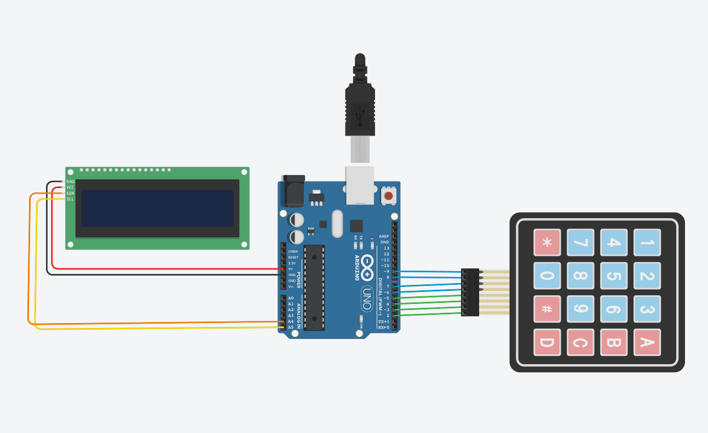

# Juego RPG con Frases.
Trabajo de Universidad.
> [!NOTE]
> _Este es un trabajo aun en proceso para la universidad, Clase Electronica_

**Materiales**
>-Pantalla LCD 16x2px.

>-Matriz 4x4 (16 Bótones).

>-Arduino Uno(USB).

>-Cables de coneccion.

## "Tu Vida Hoy"
>-Juego basado en las desiciones de la persona que tiene los botones y su dia.

### Esquema Del Circuito.


### Foto del Circuito Armado

Codigo
```
#include <Wire.h>
#include <LiquidCrystal_I2C.h>
#include <Keypad.h>

// LCD 16x2 I2C
LiquidCrystal_I2C lcd(0x27, 16, 2);

// Configuración keypad 4x4
const byte ROWS = 4;
const byte COLS = 4;
char keys[ROWS][COLS] = {
  {'A','B','C','D'},
  {'1','2','3','4'},
  {'5','6','7','8'},
  {'9','0','#','*'}
};
byte rowPins[ROWS] = {2,3,4,5};
byte colPins[COLS] = {6,7,8,9};
Keypad keypad = Keypad(makeKeymap(keys), rowPins, colPins, ROWS, COLS);

// Pines LED RGB (cambia según tu conexión)
const int pinR = 10;
const int pinG = 11;
const int pinB = 12;

// Estructura para nodo
struct Nodo {
  char linea1[17];
  char linea2[17];
  int nodoSi;
  int nodoNo;
  bool esFinal;
};

// Historia con 20 nodos, todos con línea <16 chars y bien enlazados
Nodo historia[] = {
  {"Hola, despiertas",    "Te sientes bien?", 1, 2, false},    //0
  {"Tu dia es claro",     "Quieres seguir?", 3, 4, false},    //1
  {"Dia nublado",         "Quieres parar?", 5, 6, false},    //2

  {"Sigue adelante",      "Siente paz",       7, 8, false},    //3
  {"Busca alegria",       "Intenta mas",      9, 10, false},   //4

  {"Descansa hoy",        "Habla contigo",    11, 12, false},  //5
  {"Espera y ve",         "Piensa bien",      13, 14, false},  //6

  {"Respira hondo",       "Sonrie mas",       15, 16, false},  //7
  {"Lucha un poco",       "No te rindas",     17, 18, false},  //8

  {"Encuentra paz",       "Renace luz",       19, 19, true},   //9 final
  {"Nunca pares",         "# para reiniciar", -1, -1, true},   //10 final

  {"Habla claro",         "Escucha bien",     19, 19, true},   //11 final
  {"Medita ya",           "# para reiniciar", -1, -1, true},   //12 final

  {"Piensa en ti",        "# para reiniciar", -1, -1, true},   //13 final
  {"Sigue fuerte",        "# para reiniciar", -1, -1, true},   //14 final

  {"Sonrie hoy",          "# para reiniciar", -1, -1, true},   //15 final
  {"Piensa en luz",       "# para reiniciar", -1, -1, true},   //16 final

  {"Lucha hoy",           "# para reiniciar", -1, -1, true},   //17 final
  {"Nunca cedas",         "# para reiniciar", -1, -1, true},   //18 final

  {"Paz interior",        "# para reiniciar", -1, -1, true}    //19 final
};

const int totalNodos = sizeof(historia)/sizeof(historia[0]);
int nodoActual = 0;

// Función para mostrar el nodo actual
void mostrarNodo(int index) {
  lcd.clear();
  if (index < 0 || index >= totalNodos) {
    lcd.print("Nodo invalido");
    return;
  }
  lcd.setCursor(0,0);
  lcd.print(historia[index].linea1);
  lcd.setCursor(0,1);
  lcd.print(historia[index].linea2);
}

// Función para prender LED RGB según botón
void prenderColor(char tecla) {
  switch(tecla) {
    case '1': // Rojo
      analogWrite(pinR, 255);
      analogWrite(pinG, 0);
      analogWrite(pinB, 0);
      break;
    case '2': // Verde
      analogWrite(pinR, 0);
      analogWrite(pinG, 255);
      analogWrite(pinB, 0);
      break;
    case '3': // Azul
      analogWrite(pinR, 0);
      analogWrite(pinG, 0);
      analogWrite(pinB, 255);
      break;
    case '4': // Amarillo
      analogWrite(pinR, 255);
      analogWrite(pinG, 255);
      analogWrite(pinB, 0);
      break;
    case '5': // Cyan
      analogWrite(pinR, 0);
      analogWrite(pinG, 255);
      analogWrite(pinB, 255);
      break;
    case '6': // Magenta
      analogWrite(pinR, 255);
      analogWrite(pinG, 0);
      analogWrite(pinB, 255);
      break;
    case '7': // Blanco
      analogWrite(pinR, 255);
      analogWrite(pinG, 255);
      analogWrite(pinB, 255);
      break;
    case '8': // Apaga LED
      analogWrite(pinR, 0);
      analogWrite(pinG, 0);
      analogWrite(pinB, 0);
      break;
    default:
      break;
  }
}

void setup() {
  lcd.init();
  lcd.backlight();

  pinMode(pinR, OUTPUT);
  pinMode(pinG, OUTPUT);
  pinMode(pinB, OUTPUT);
  analogWrite(pinR, 0);
  analogWrite(pinG, 0);
  analogWrite(pinB, 0);

  mostrarNodo(nodoActual);
}

void loop() {
  char tecla = keypad.getKey();
  if (tecla) {
    if (tecla == '#') {
      nodoActual = 0;
      mostrarNodo(nodoActual);
    }
    else if (tecla == 'A') {
      int siguiente = historia[nodoActual].nodoSi;
      if (siguiente == -1) {
        lcd.clear();
        lcd.print("Fin final");
      } else {
        nodoActual = siguiente;
        mostrarNodo(nodoActual);
      }
    }
    else if (tecla == 'B') {
      int siguiente = historia[nodoActual].nodoNo;
      if (siguiente == -1) {
        lcd.clear();
        lcd.print("Fin final");
      } else {
        nodoActual = siguiente;
        mostrarNodo(nodoActual);
      }
    }
    else {
      // Otros botones para LED RGB
      prenderColor(tecla);
    }
  }
}
```
